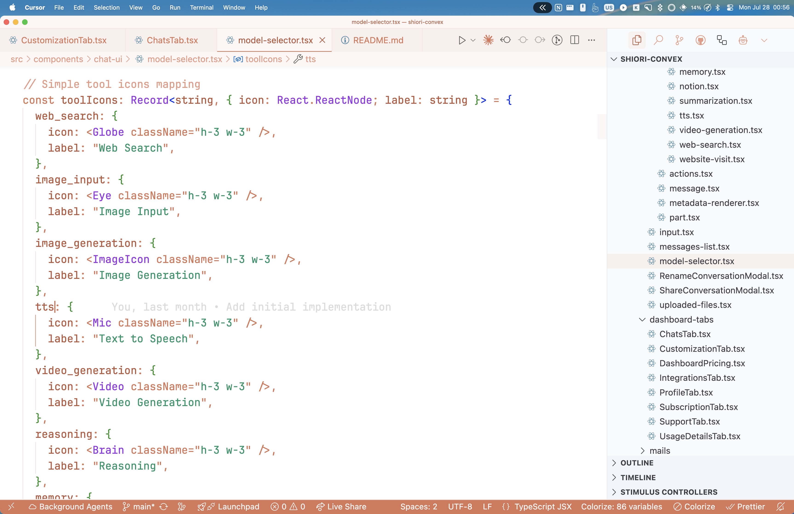
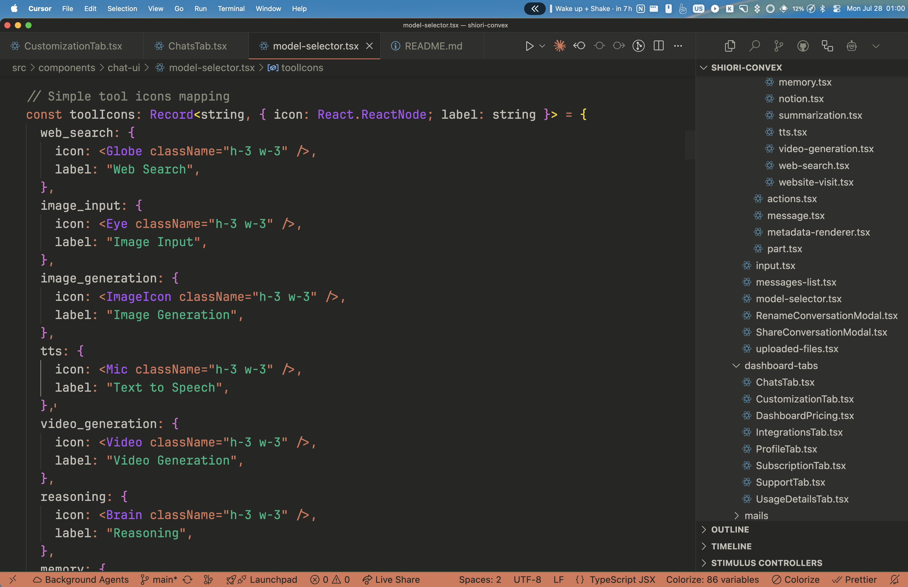

# Claude Theme for VS Code/Cursor/Windsurf

A beautiful theme inspired by the Claude Desktop application, featuring both light and dark variants with carefully crafted color palettes using modern OKLCH color space.

## Screenshots

  
  
Claude Light Theme

  
  
Claude Dark Theme

## Features

- **Claude Light**: Clean, minimal light theme with warm whites and subtle contrasts
- **Claude Dark**: Elegant dark theme with comfortable backgrounds and rich syntax highlighting
- **Complete Coverage**: Full theme coverage for all VS Code UI elements, syntax highlighting, and terminal colors
- **Modern Color Science**: Based on OKLCH color values for perceptually uniform color experiences

## Color Palette

The theme uses the official Claude color palette converted from OKLCH to hex values:

### Light Theme
- Background: `#fefefe` (warm white)
- Foreground: `#3c3c43` (dark gray)
- Primary: `#d97706` (amber/orange)
- Secondary: `#f1f5f9` (light gray-blue)

### Dark Theme
- Background: `#1a1a1a` (deep charcoal)
- Foreground: `#e4e4e7` (light gray)
- Primary: `#f59e0b` (bright amber)
- Secondary: `#262626` (dark gray)

## Installation

### From VS Code Marketplace
1. Open VS Code/Cursor/Windsurf
2. Go to Extensions (Ctrl+Shift+X)
3. Search for "Claude Theme"
4. Click Install

### Manual Installation
1. Download the extension
2. Copy to your extensions folder:
   - **Windows**: `%USERPROFILE%\.vscode\extensions`
   - **macOS**: `~/.vscode/extensions`
   - **Linux**: `~/.vscode/extensions`

## Usage

1. Open VS Code/Cursor/Windsurf
2. Go to File → Preferences → Color Theme (Ctrl+K Ctrl+T)
3. Select either:
   - **Claude Light** for the light variant
   - **Claude Dark** for the dark variant

## Screenshots

*Screenshots coming soon...*

## Contributing

Feel free to open issues or submit pull requests to improve the theme!

## License

MIT License
